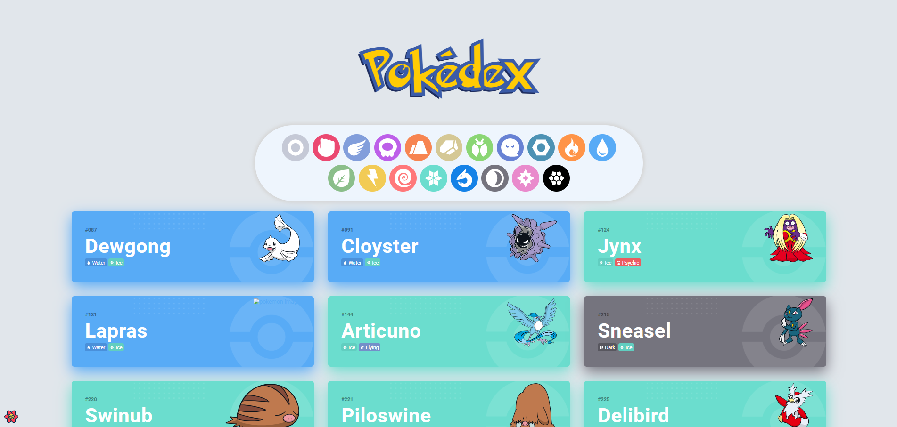
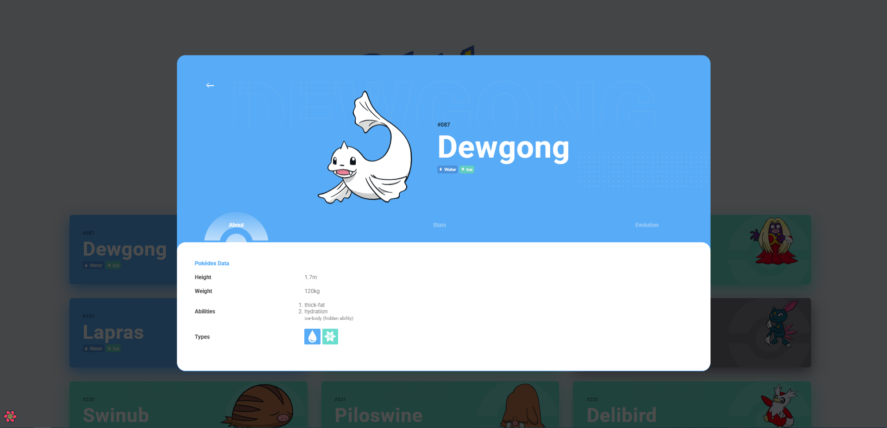
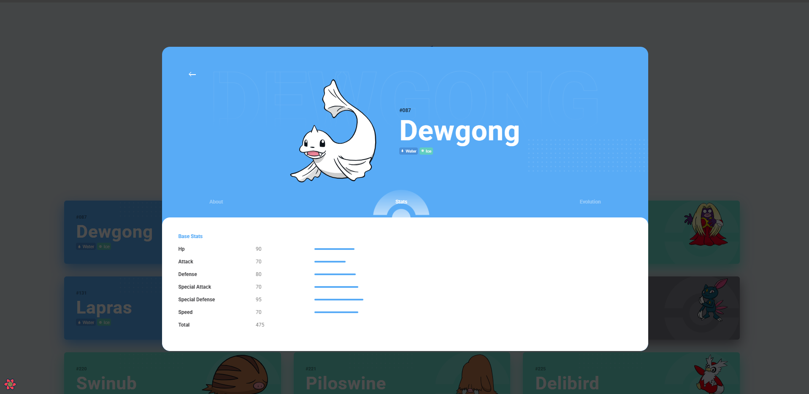

# Aplicativo Pokédex em React


Uma aplicação moderna de Pokédex construída com React que permite descobrir e explorar Pokémon usando dados da [PokéAPI](https://pokeapi.co/). Navegue por Pokémon por tipo, visualize informações detalhadas e explore cadeias de evolução em uma interface intuitiva e visualmente atraente.

## Demonstração ao Vivo

[Acesse a Aplicação Pokédex ao Vivo](https://d-s-web-i-trabalho-01.vercel.app/)

## Capturas de Tela

| Tela Principal            | Detalhes do Pokémon            | Visualização de Estatísticas            |
| ------------------------- | ------------------------------ | --------------------------------------- |
|  |  |  |

## Funcionalidades

- Filtrar e navegar por Pokémon por tipo com uma interface de seleção intuitiva
- Modal detalhado para cada Pokémon com abas de informação:
  - **Aba Sobre**: Informações básicas como altura, peso, habilidades e tipos
  - **Aba Estatísticas**: Representação visual dos atributos básicos com escala comparativa
  - **Aba Evolução**: Visualização completa da cadeia evolutiva
- Design responsivo que funciona em dispositivos móveis e desktops
- Busca de dados otimizada com React Query para cache e estados de carregamento eficientes
- Interface bonita inspirada no [Dribbble de Flavio Farias](https://dribbble.com/flaviofpsj) [Design no Dribbble](https://dribbble.com/shots/11114913-Pok-dex-App)

## Tecnologias Utilizadas

- **React** - Biblioteca de UI para o frontend
- **React Query** - Gerenciamento de estado e busca de dados
- **Vite** - Ferramenta de build e servidor de desenvolvimento
- **Radix UI** - Componentes de UI acessíveis
- **CSS** - Estilização (CSS personalizado sem frameworks)
- **Jest** - Framework de testes
- **PokéAPI** - Fonte de dados dos Pokémon

## Instalação e Configuração

### Pré-requisitos

- Node.js (versão 14 ou superior)
- npm (versão 6 ou superior) ou yarn

### Passos para Instalação

1. Clone o repositório:

   ```bash
   git clone https://github.com/josedudias/D.S.-WEB-I-Trabalho-01.git
   ```

2. Acesse o diretório do projeto:

   ```bash
   cd D.S.-WEB-I-Trabalho-01
   ```

3. Instale as dependências:

   ```bash
   npm install
   ```

4. Inicie o servidor de desenvolvimento:

   ```bash
   npm run dev
   ```

5. Abra seu navegador e navegue até `http://localhost:5173` para visualizar a aplicação.

#### Scripts Disponíveis

- `npm run dev`: Inicia o servidor de desenvolvimento.
- `npm run build`: Constrói o aplicativo para produção.
- `npm run preview`: Previsualiza o build de produção localmente.
- `npm run test`: Executa a suíte de testes.

### Estrutura do Projeto

```
src/
  ├── components/        # Componentes de UI
  │   ├── modal/         # Componentes de modal e abas
  │   └── ...
  ├── context/           # Provedores de contexto React
  ├── hooks/             # Hooks personalizados do React
  │   └── __tests__/     # Testes de hooks
  ├── utils/             # Funções utilitárias
  ├── [App.jsx]          # Componente principal da aplicação
  ├── [App.css]          # Estilos globais
  └── [main.jsx]         # Ponto de entrada da aplicação
```
